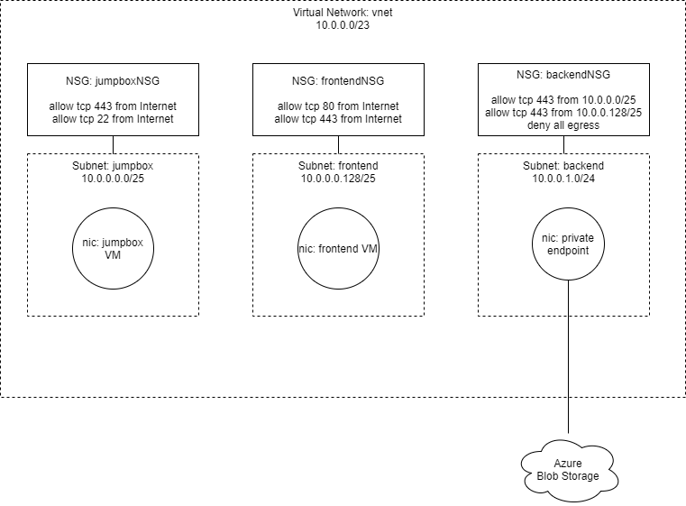

## Overview



## Usage

```shell
# Deployment
az deployment group create -g labyrinth-sample -f azuredeploy.json
```

Exploring resources

```shell
# Option 1: Export a template with all* resources
# Note: some resources & properties cannot be exported, but that shouldn't affect this exercise
az group export -n labyrinth-sample --skip-all-params

# Option 2: Azure Resource Graph (there's a Portal query experience too)
# Install the CLI extension
az extension add --name resource-graph

# Run a query to get everything (note: this is Kusto syntax)
az graph query -q 'resources | where resourceGroup == "labyrinth-sample"'
```

Validating the private network configuration

```shell
# Generate a SAS URL to download a blob
export AZURE_STORAGE_ACCOUNT=$(az storage account list -g labyrinth-sample --query '[0].name' -o tsv)
export SAS_URI=$(az storage blob generate-sas -c testdata -n hello.txt --full-uri -o tsv)
echo $SAS_URI

# Try to access the blob from your machine (not allowed - outside the VNET)
curl -v $SAS_URI

# SSH access to jumpbox
az vm user update -u $USER -g labyrinth-sample -n jumpbox

# Get public IP and SSH to the jumpbox
IP=$(az vm show -g labyrinth-sample -n jumpbox -d --query 'publicIps' -o tsv)
ssh $USER@$IP

# Try to access the blob from the jumpbox (allowed - inside the VNET)
# Note: the surrounding quotes are important in this command, otherwise bash will try to interpret characters in the url
curl '<SAS_URI from above>'
```

